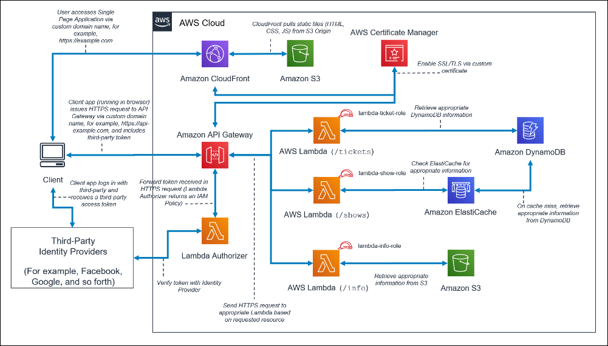
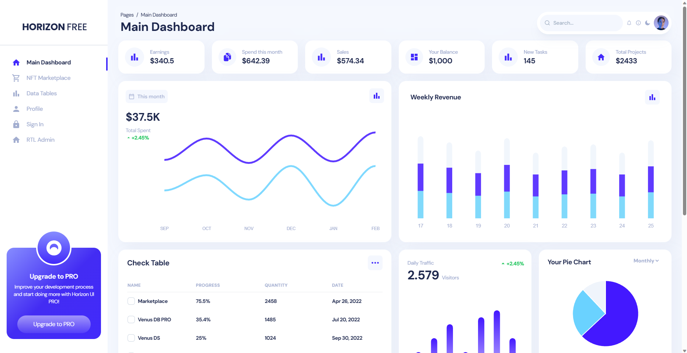
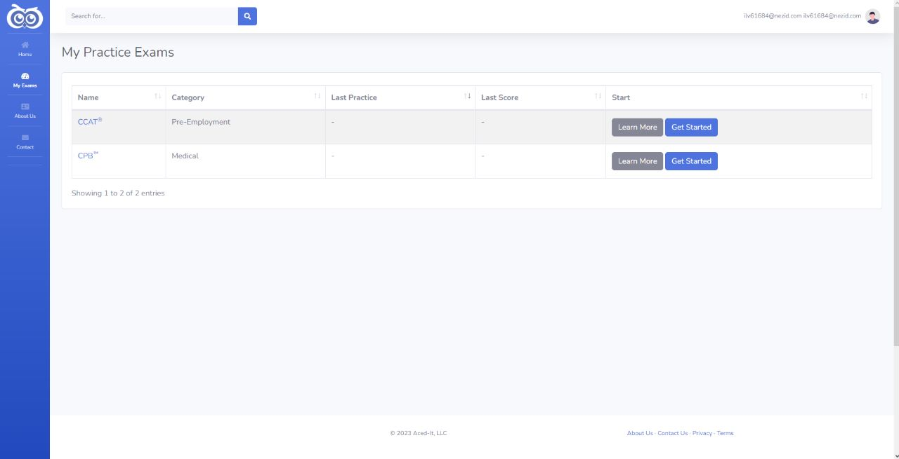

# 🌐 Project Details for PrepPrac (Preparatory Practice) Website.
Preparatory Practice is a SaAS application that provides mock test for learning and exams prepration.

## Architectural diagram.

## APIs and Endpoints.
### Auth routes.
1.	User Registration:
	- Endpoint: POST /api/users/register
	- Description: This endpoint allows a new user to register and create an account.
	- Request Body: JSON object containing user registration details (email, password).
	- Response: JSON object with a success message or error message.
2.	User Login:
	- Endpoint: POST /api/users/login
	- Description: This endpoint handles user authentication and generates a session or token for the user to use in subsequent requests.
	- Request Body: JSON object containing user login credentials (e.g., email, password).
	- Response: JSON object with a success message and a token or session ID, or an error message.
3.	User Logout:
	- Endpoint: POST /api/users/logout
	- Description: This endpoint handles user logout and invalidates the user's session or token.
	- Request Headers: Authorization token or session ID.
	- Response: JSON object with a success message or error message.
4.	Password Reset:
	- Endpoint: POST /api/users/password-reset
	- Description: This endpoint allows users to request a password reset when they have forgotten their password.
	- Request Body: JSON object containing the user's email or username to initiate the password reset process.
	- Response: JSON object with a success message or error message.
	- Endpoint: POST /api/users/password-reset/{reset_token}
	- Description: This endpoint allows users to reset their password using a reset token received via email.
	- Request Parameters: reset_token (a unique token sent to the user's email).
	- Request Body: JSON object containing the new password.
	- Response: JSON object with a success message or error message.

### Tests routes.
1.	Create a Test:
	- Endpoint: POST /api/tests
	- Description: Allows authenticated users to create a new test.
	- Request Body: JSON object containing test details (e.g., test name, duration, instructions, questions, options, etc.).
	- Authorization: User must include a valid authentication token in the request headers.
	- Response: JSON object with a success message or error message.
2.	Update a Test:
	- Endpoint: PUT /api/tests/{test_id}
	- Description: Allows authenticated users to update an existing test.
	- Request Parameters: test_id (the unique identifier of the test to be updated).
	- Request Body: JSON object containing updated test details.
	- Authorization: User must include a valid authentication token in the request headers.
	- Response: JSON object with a success message or error message.
3.	Delete a Test:
	- Endpoint: DELETE /api/tests/{test_id}
	- Description: Allows authenticated users to delete a test.
	- Request Parameters: test_id (the unique identifier of the test to be deleted).
	- Authorization: User must include a valid authentication token in the request headers.
	- Response: JSON object with a success message or error message.
4.	Add Questions to Test:
	- Endpoint: POST /api/tests/{test_id}/questions
	- Description: Allows authenticated users to add questions to an existing test.
	- Request Parameters: test_id (the unique identifier of the test to which the questions will be added).
	- Request Body: JSON object containing question details (e.g., question text, options, correct answer, etc.).
	- Authorization: User must include a valid authentication token in the request headers.
	- Response: JSON object with a success message or error message.
5.	Remove Questions from Test:
	- Endpoint: DELETE /api/tests/{test_id}/questions/{question_id}
	- Description: Allows authenticated users to remove a specific question from a test.
	- Request Parameters:
	- test_id (the unique identifier of the test from which the question will be removed).
	- question_id (the unique identifier of the question to be removed).
	- Authorization: User must include a valid authentication token in the request headers.
	- Response: JSON object with a success message or error message.

### Take test routes.
1.	Take a Test:
	- Endpoint: POST /api/tests/{test_id}/take
	- Description: Allows authenticated users to take a specific test.
	- Request Parameters: test_id (the unique identifier of the test to be taken).
	- Authorization: User must include a valid authentication token in the request headers.
	- Response: JSON object with test details and questions, allowing the user to submit their answers.
2.	Submit Test Answers:
	- Endpoint: POST /api/tests/{test_id}/submit
	- Description: Allows authenticated users to submit their answers for a specific test.
	- Request Parameters: test_id (the unique identifier of the test for which answers are being submitted).
	- Authorization: User must include a valid authentication token in the request headers.
	- Request Body: JSON object containing the user's answers (e.g., question_id and selected_option).
	- Response: JSON object with the test result (e.g., score, correct/incorrect answers, etc.).
3.	View Test Results:
	- Endpoint: GET /api/tests/{test_id}/results
	- Description: Allows authenticated users to view their results for a specific test.
	- Request Parameters: test_id (the unique identifier of the test for which results are being requested).
	- Authorization: User must include a valid authentication token in the request headers.
	- Response: JSON object with the test results, including the score and details of each question (e.g., user's answer, correct answer, etc.).
4.	View All Test Results:
	- Endpoint: GET /api/tests/results
	- Description: Allows authenticated users (e.g., instructors, administrators) to view results for all tests.
	- Authorization: User must include a valid authentication token in the request headers with sufficient privileges.
	- Response: JSON object containing the results of all tests, grouped by test and user.

## Technology.

### Serverless multi-tier applications on AWS cloud.
Architecture pattern where developers can build and deploy multi-tier applications 
without the need to manage traditional servers or infrastructure. 
It involves using AWS managed services for each tier of the application, 
including;

#### Three-tier architecture pattern.

1. The Presentation tier (frontend), will be implemented using AWS Service:
	1. Static web hosting on Amazon S3 with Amazon CloudFront
2. The Logic tier (backend), will be implemented by using AWS Services: 
	1. API Gateway for APIs with Amazon CloudFront.
	2. Lambda for code functions.
3. The Data tier (database), will be implemented using AWS Service:
	1. Amazon DynamoDB.

#### Other AWS Services to be used.
1. Amazon CloudWatch -near real-time metrics for monitoring API execution.
2. AWS X-Ray - tracing for debugging.
3. AWS WAF - web application firewall which helps protect APIs from attacks.

## Mockups.

